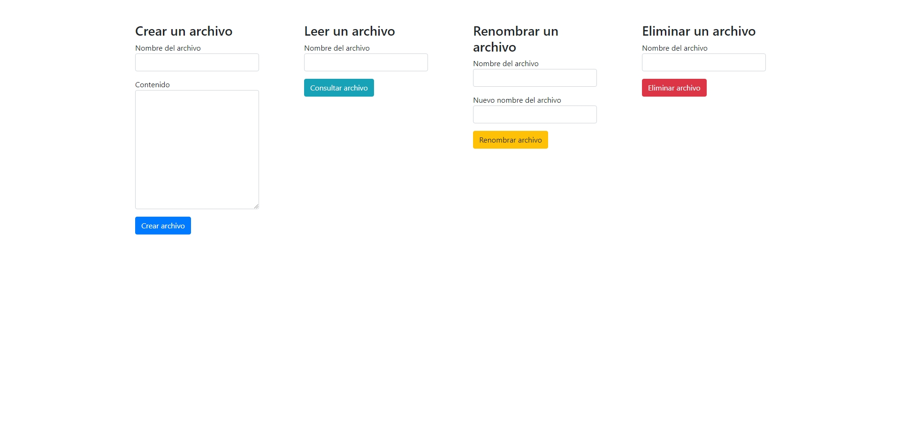

# Desafío opcional - Servidores Welcome World

## Descripción

La compañía Welcome World Spa se dedica a ofrecer servidores y paneles de control con herramientas de FTP. Para mejorar su plataforma, necesitan una funcionalidad que permita a los usuarios crear, leer, renombrar y eliminar archivos en el servidor. 

Este desafío implica construir un servidor con Express que gestione archivos en el servidor a través de diversas rutas, utilizando parámetros enviados en consultas GET y formularios HTML. Se requiere que implementes las rutas necesarias para realizar operaciones CRUD sobre los archivos, y que manejes las respuestas adecuadamente.

## Vista del Diseño

Aquí puedes ver la imagen del diseño que se utilizó como referencia:

## Requerimientos

1. **Ruta para crear un archivo**:
   - Disponibiliza una ruta para crear un archivo a partir de los parámetros de la consulta recibida.

2. **Ruta para leer un archivo**:
   - Disponibiliza una ruta para devolver el contenido de un archivo cuyo nombre es declarado en los parámetros de la consulta recibida.

3. **Ruta para renombrar un archivo**:
   - Disponibiliza una ruta para renombrar un archivo, cuyo nombre actual y nuevo nombre son declarados en los parámetros de la consulta recibida.

4. **Ruta para eliminar un archivo**:
   - Disponibiliza una ruta para eliminar un archivo, cuyo nombre es declarado en los parámetros de la consulta recibida.

5. **Mensajes de éxito o fracaso**:
   - Deberás devolver un mensaje declarando el éxito o fracaso de cada operación solicitada.

6. **Formato de fecha en el contenido del archivo**:
   - Agrega la fecha actual al comienzo del contenido de cada archivo creado en formato "dd/mm/yyyy". Considera que si el día o el mes es menor a 10, deberás concatenar un “0” a la izquierda.

7. **Mensaje de éxito al renombrar**:
   - En la ruta para renombrar, devuelve un mensaje de éxito que incluya el nombre anterior del archivo y el nuevo nombre de forma dinámica.

## Tecnologías Utilizadas

- **Node.js**: Entorno de ejecución para JavaScript en el servidor.
- **Express**: Framework para Node.js que facilita la creación y manejo del servidor y las rutas.
- **File System (fs)**: Módulo de Node.js para manipulación de archivos y directorios.
- **HTML**: Lenguaje de marcado para estructurar formularios y páginas.

## Autor

Este proyecto fue desarrollado por **Valeria Torrealba**.
